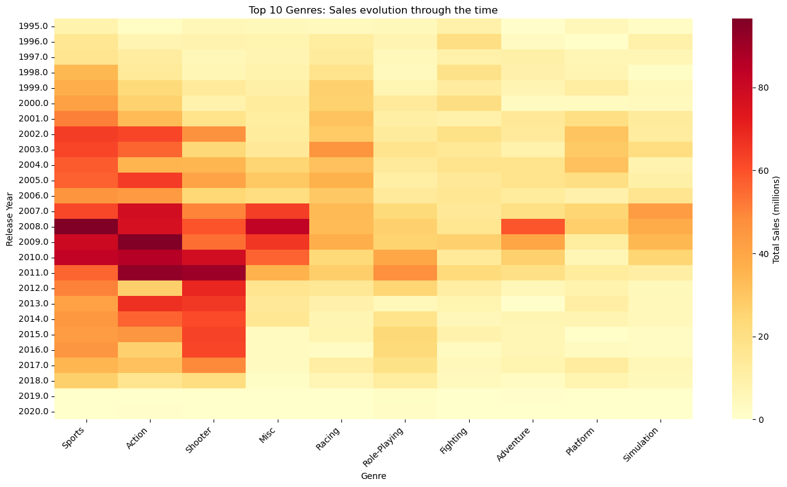

# Video Game Sales: Exploratory Data Analysis 

# Video Game Market Analysis ([60k+ titles](https://www.kaggle.com/datasets/siddharth0935/video-game-sales))

A data-driven exploration of global video game sales to understand:

- Which genres dominate revenue vs volume
- How regional markets differ (NA, EU, JP)
- How genre popularity evolved over time
- Which publishers and platforms shaped the industry

---

## Key Insights

- Sports generates more revenue than Action despite fewer titles
- Japan has a structurally different genre preference (RPG dominance)
- Shooters are highly concentrated in blockbuster franchises
- Minecraft is a strong example of distribution skew affecting averages

---

---
## Questions explored

- Which genres dominate by volume, total sales, and average sales per title — and do they tell the same story?
- How does Japan's market differ from North America and Europe?
- Which publishers and consoles have moved the most software historically?
- How have genre preferences shifted over time?

---

## Key findings

**Sports outperforms Action despite fewer titles.** Action has the most games in the catalog, but Sports leads in total global sales — suggesting fewer titles with higher individual commercial success, likely driven by annual franchise releases.

**Shooters punch above their weight.** Ranked sixth in number of titles, Shooters rank third in total sales. Blockbuster franchises concentrate the revenue.

**Japan is the RPG exception.** It's the only major market where Role-Playing games outsell both Sports and Action. Any publisher targeting Japan needs a genre strategy distinct from the global playbook.

**Averages can mislead with small samples.** The Sandbox genre appeared to have the highest average sales per game — because it contained a single entry: Minecraft. Correcting this (and fixing genre mislabeling across all Minecraft platform entries) brought Sandbox back to a realistic position.

**Genre dominance has shifted over time.** The heatmap of the top 10 genres across release years shows that Platform and Fighting games have progressively lost market share since the 2000s, while Action and Sports have consolidated their lead.

---

## Business relevance

This analysis can support:

- Game publishing strategy
- Regional market targeting
- Portfolio planning for studios
- Genre investment decisions

---
## Data cleaning decisions

The raw dataset required non-trivial decisions before any analysis:

**Missing numeric values → replaced with -1.**
A -1 flag keeps the record intact while making the absence explicit, and is excluded via mask before any calculation.

**Two datasets maintained in parallel.**
Only ~2,200 of 60k+ entries had complete regional sales data. Rather than discarding the rest, the analysis uses the full dataset for genre/title counts and a filtered `sales_dataset` for revenue analysis.

**Regional zero-fill for titles with valid total sales.**
If a game has a `total_sales` figure but missing regional data, the missing fields are treated as 0 (not sold in that region).

---

## Tech stack

| Tool | Purpose |
|---|---|
| `pandas` | Data loading, cleaning, transformation, groupby aggregations |
| `numpy` | Sentinel values and masking |
| `seaborn` / `matplotlib` | Bar charts, regional comparisons, genre heatmap over time |

---

## Dataset

[Video Game Sales — VGChartz (Kaggle)](https://www.kaggle.com/datasets/siddharth0935/video-game-sales) — 60k+ titles with sales by region, critic scores, genre, publisher, developer, and release date.
